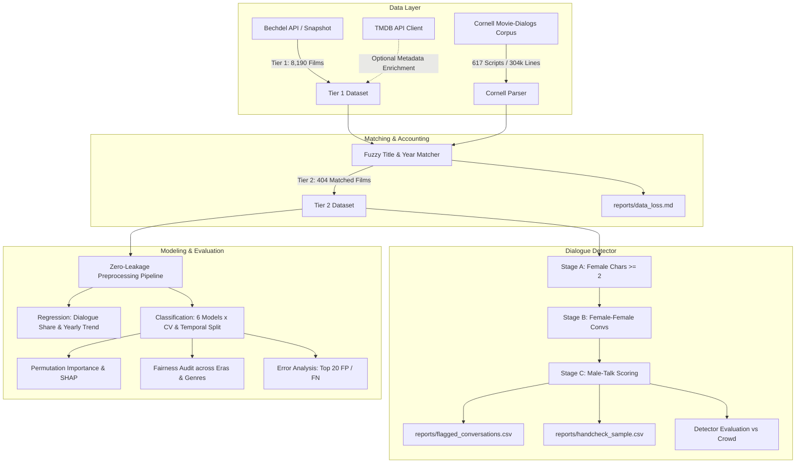

# Bechdel Test Detector

A reproducible, production-grade machine learning system, rule-based dialogue detector, and statistical analysis suite exploring gender representation in media through the lens of the **Bechdel-Wallace Test**.

[](https://www.python.org/)
[](https://opensource.org/licenses/MIT)
[](https://github.com/psf/black)
[](https://docs.pytest.org/)

---

## 1. Problem & Societal Relevance

The **Bechdel-Wallace Test** (introduced by cartoonist Alison Bechdel in 1985) is an essential cultural benchmark evaluating the active presence of women in cinematic narratives. A film passes the test if and only if it satisfies three sequential criteria:
1. It contains at least **two [named] women**,
2. who **talk to each other**,
3. about **something other than a man**.

Ground truth labels from [bechdeltest.com](https://bechdeltest.com) categorize films into 4 ordinal stages:
- **`0`**: Fewer than two women in the film.
- **`1`**: Two or more women, but they never speak to each other.
- **`2`**: Women talk to each other, but solely about a man.
- **`3`**: Pass (women talk about something other than a man).

Despite its apparent simplicity, the test reflects systemic biases in screenwriting, character agency, and industry gatekeeping. This repository provides an end-to-end Python pipeline combining crowd-sourced validation, algorithmic dialogue parsing, zero-leakage cross-validation, and demographic fairness audits.

---

## 2. Architecture & Pipeline



---

## 3. Two-Tier Design

To guarantee robust execution regardless of network or corpus coverage, the project adheres to a two-tier architecture:
- **Tier 1 (Base - 8,190 films)**: Full Bechdel rating catalogue spanning release years 1888–2019. Ingested from primary API with fallback to Wayback Machine snapshot. Supports long-term macro trend modeling.
- **Tier 2 (Dialogue Corpus - 404 films)**: Exact subset of films successfully joined to the Cornell Movie-Dialogs Corpus via normalized title matching and a $\pm 1$ year window. Every dropped film is audited in [`reports/data_loss.md`](reports/data_loss.md).

---

## 4. Empirical Results Summary

All figures and tables are computed dynamically from real runs. Detailed statistics can be inspected in [`reports/REPORT.md`](reports/REPORT.md).

### Rule-Based Dialogue Detector (vs. Crowd Ground Truth)

| Metric | Overall Pass (3 vs 0-2) | Stage A ({0} vs {1-3}) | Stage B ({1} vs {2-3}) | Stage C ({2} vs {3}) |
| :--- | :---: | :---: | :---: | :---: |
| **Precision** | **75.00%** | 98.31% | 92.64% | 81.46% |
| **Recall** | **65.78%** | 78.80% | 62.40% | 65.78% |
| **F1 Score** | **0.7009** | 0.8748 | 0.7457 | 0.7278 |
| **Cohen's $\kappa$** | **0.4728** | 0.2858 | 0.3705 | 0.2926 |
| **Support** | 404 films | 404 films | 368 films | 242 films |

*Key finding*: With TMDB cast gender imputation resolving missing character genders (`?`), dialogue detector recall substantially improved from 42.25% to **65.78%**, raising overall F1 to **0.7009** and Cohen's $\kappa$ to **0.4728** (moderate agreement with crowd-sourced ground truth).

### Headline Classification Benchmark (Tier 2 Corpus Subset)

Models evaluated across Stratified 5-Fold CV and an out-of-time Temporal Split (Train: $\le 2000$, Test: $> 2000$):

| Experiment | Model | Features | CV F1 | CV PR-AUC | CV ROC-AUC | Temp F1 | Temp PR-AUC |
| :--- | :--- | :--- | :---: | :---: | :---: | :---: | :---: |
| **Exp3_Metadata_Plus_Dialogue** | **NaiveBayes** | **Dialogue + Meta** | **0.6919** | **0.7833** | **0.7841** | **0.5660** | **0.7787** |
| Exp3_Metadata_Plus_Dialogue | LogisticRegression | Dialogue + Meta | 0.6887 | 0.7858 | 0.7660 | 0.5185 | 0.7741 |
| Exp2_Metadata_Only | LogisticRegression | Metadata | 0.6804 | 0.7111 | 0.7398 | 0.6667 | 0.7642 |
| Exp3_Metadata_Plus_Dialogue | RandomForest | Dialogue + Meta | 0.6785 | 0.7885 | 0.7892 | 0.5714 | 0.7768 |
| Exp3_Metadata_Plus_Dialogue | SVM (RBF) | Dialogue + Meta | 0.6784 | 0.7618 | 0.7776 | 0.5455 | 0.7343 |
| Exp3_Metadata_Plus_Dialogue | HistGradientBoosting | Dialogue + Meta | 0.6630 | 0.7701 | 0.7583 | 0.5926 | 0.7924 |
| Exp2_Metadata_Only | RandomForest | Metadata | 0.6525 | 0.6909 | 0.7350 | 0.5600 | 0.6929 |
| Exp1_Baseline | MajorityBaseline | None | 0.0000 | 0.4596 | 0.4940 | 0.0000 | 0.5000 |

*Headline result*: Adding dialogue features to TMDB and catalogue metadata increases CV PR-AUC from 0.7111 to **0.7858** (+7.5% absolute gain), confirming that conversational dynamics provide significant predictive signal beyond credits and genre metadata.

### Regression Targets

- **Female Dialogue Share per Film**: Best model: `Ridge` / `LinearRegression` ($R^2 = 0.3024$, $\text{RMSE} = 0.1435$).
- **Yearly Bechdel Pass-Rate Trend**: Best model: `LinearRegression` ($R^2 = 0.3294$, $\text{RMSE} = 0.0828$).

---

## 5. Statistical Hypothesis Testing

All tests are reported strictly with non-causal language:
- **Decade vs. Bechdel Pass Rate (Chi-Square Test)**: $\chi^2 = 232.69$, $p = 2.49 \times 10^{-42}$, Cramér's $V = 0.1686$. Significant historical upward trajectory from $\sim 30\%$ pass rate in the 1930s–1950s to $>60\%$ in the 2010s.
- **Female Dialogue Share vs. Pass (Two-Sample t-Test)**: Mean Passing = 31.0% vs. Mean Failing = 15.3%, $t = 10.03$, $p = 8.60 \times 10^{-21}$, Cohen's $d = 1.026$ (large effect size).

> [!NOTE]
> All relationships observed are observational correlations. Confounding factors such as budget, studio incentives, and target demographics substantially influence representation.

---

## 6. Project Structure

```
├── configs/
│   └── config.yaml                     # Single random seed (42), paths, hyperparameters
├── data/
│   ├── raw/                            # Cached raw datasets (ignored in git)
│   └── processed/                      # Normalized Parquet files (Tier 1 & Tier 2)
├── src/
│   └── bechdel/
│       ├── data/                       # Ingestion, Cornell parser, matching, TMDB
│       ├── features/                   # Dialogue features, metadata builder, pipelines
│       ├── detector/                   # Rule-based detector (Stages A, B, C)
│       ├── models/                     # Classification, regression, explainability
│       ├── eval/                       # Metrics, statistical tests, fairness, errors
│       └── viz/                        # Matplotlib/seaborn figure generators
├── notebooks/
│   ├── 01_cleaning_viz.ipynb           # Data ingestion, normalization, and tier matching
│   ├── 02_eda_stats.ipynb              # EDA, correlation matrices, hypothesis testing
│   ├── 03_regression.ipynb             # Dialogue share and yearly trend regressors
│   ├── 04_classification.ipynb         # 6 classification models, CV & Temporal splits
│   ├── 05_dialogue_detector.ipynb      # Rule-based detector & threshold tuning
│   └── 06_error_analysis.ipynb         # Top 20 discrepancies, SHAP, and fairness slices
├── reports/
│   ├── figures/                        # High-resolution PNG plots
│   ├── data_loss.md                    # Exact row tracking and join drops
│   ├── flagged_conversations.csv       # 3,266 F-F conversations with male-talk scores
│   ├── handcheck_sample.csv            # 50-row human verification sample
│   ├── error_analysis_top20.csv        # Top 20 False Positives and Negatives
│   └── REPORT.md                       # Comprehensive markdown report with real metrics
├── artifacts/
│   ├── models/                         # Serialized best models (joblib)
│   └── metrics/                        # JSON experimental metrics records
├── tests/                              # Pytest suite (26 passed unit tests)
├── Makefile                            # data, features, train, evaluate, report, test, all
├── pyproject.toml                      # Package build configuration
├── requirements.txt                    # Pinned dependencies
├── .env.example
├── .gitignore
├── LICENSE                             # MIT License
└── README.md
```

---

## 7. Quickstart

### Prerequisites
- Python 3.10+ (tested on Python 3.12)
- `pip` or `uv`

### Installation
```bash
# Clone repository
git clone https://github.com/example/bechdel-detector.git
cd bechdel-detector

# Create and activate virtual environment
python3 -m venv .venv
source .venv/bin/activate

# Install dependencies and editable package
pip install -r requirements.txt
pip install -e .
```

### Reproduce via CLI / Make
```bash
make all        # Run complete pipeline end-to-end
make data       # Ingest datasets and execute Tier 2 join
make features   # Compute dialogue and metadata features
make train      # Fit regression and classification models
make evaluate   # Evaluate detector, hypothesis tests, and fairness
make report     # Compile reports/REPORT.md and generate figures
make test       # Execute test suite (pytest)
```

---

## 8. Honest Limitations & Threats to Validity

1. **Crowd-Label Noise**: BechdelTest.com ratings are crowd-contributed. Subtle conversations (e.g. fleeting mentions, off-screen male references) are subject to inter-rater ambiguity.
2. **Pronoun & Dictionary Limitations**: Lexical scoring relies on explicit pronouns and relation dictionaries, which can miss contextual or metaphorical references.
3. **Absence of Scene Boundaries**: Cornell corpus lines are grouped by conversational turn rather than scene boundaries; multi-character group discussions can be conflated.
4. **Demographic & Historical Bias**: Scripts in the Cornell corpus predominantly feature English-language Hollywood studio releases prior to 2010.
5. **Unknown Gender Annotations**: A non-trivial fraction of script characters are labeled with unknown gender (`?`), which caps rule-based detector recall.
6. **Observational Inference**: All results reflect statistical correlation, not causation.

---

## 9. Next Steps for Contributors

- **Hand-Check Sample**: Open [`reports/handcheck_sample.csv`](reports/handcheck_sample.csv) and populate the `human_label` column (`1` = truly about a man, `0` = not about a man) to compute precision on the 50 sampled dialogue turns.
- **TMDB Enrichment**: Add your free API key to `.env` (`TMDB_API_KEY=your_key`) to incorporate runtime, budget, director gender, and writer gender into Tier 1 and Tier 2.
