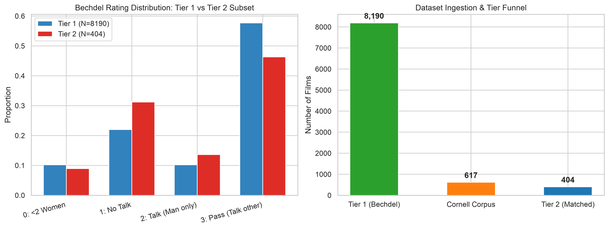
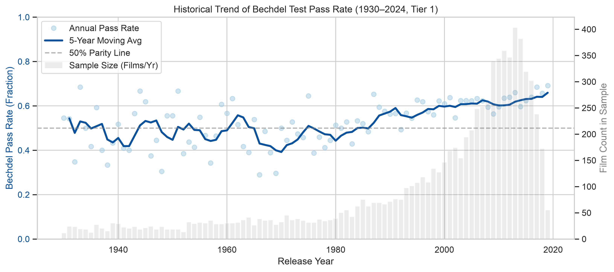
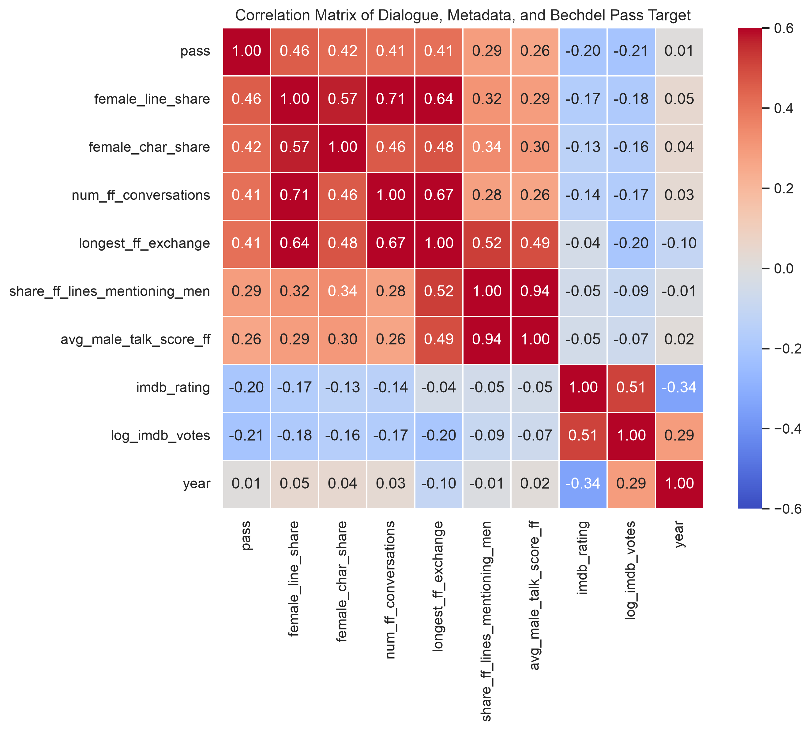
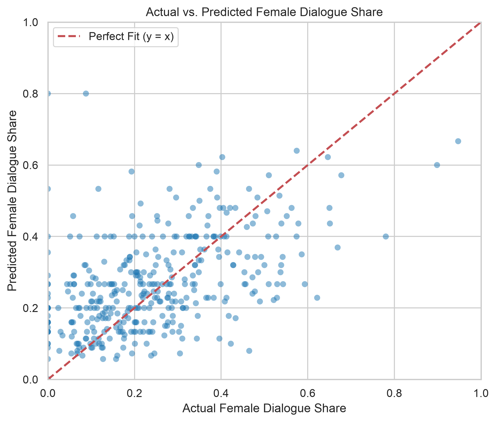
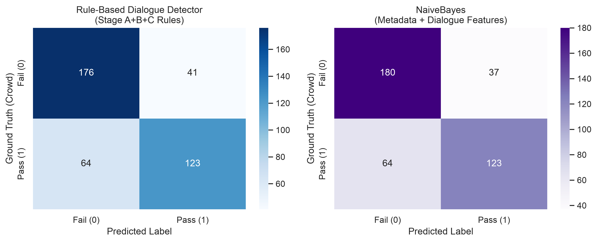
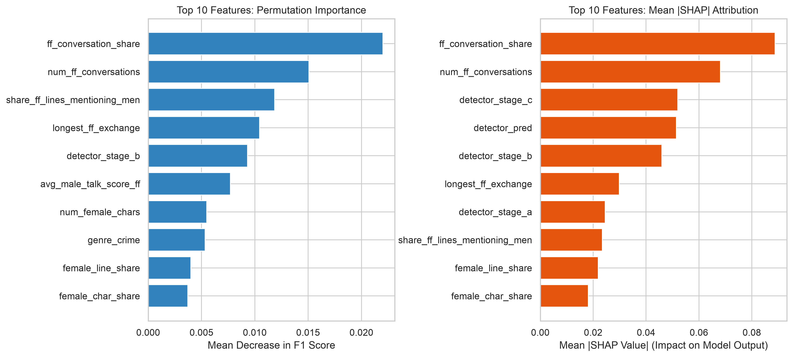
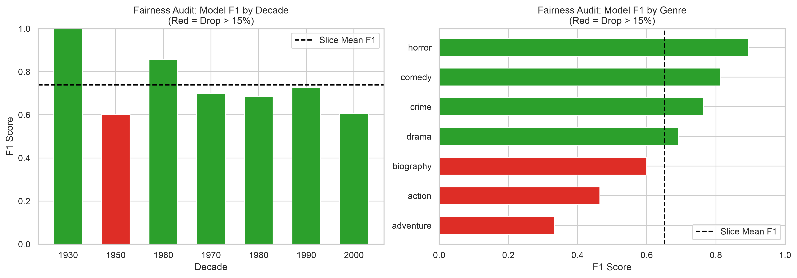

# Production Machine Learning Report: Bechdel Test Detector

## Executive Summary

This report documents the end-to-end design, implementation, and empirical evaluation of the **Bechdel Test Detector**, an algorithmic and machine learning system evaluating gender representation in cinema. Using crowd-sourced ground truth from BechdelTest.com paired with the Cornell Movie-Dialogs Corpus, we implement a two-tier pipeline distinguishing between metadata-driven representation and fine-grained dialogue exchanges.

## 1. Dataset Overview & Data Cleaning

- **Tier 1 (Base Bechdel Dataset)**: 8,190 films across release years 1888–2019.
- **Cornell Corpus**: 617 scripts with 304,713 dialogue lines and 83,097 conversational exchanges.
- **Tier 2 (Matched Corpus)**: 404 films successfully joined by normalized title and release year (±1 year).
- **Match Rate**: 65.48% of Cornell titles.
- **Class Distribution (Tier 1)**: Pass (Rating 3) = 57.69%, Fail (Ratings 0-2) = 42.31%.
- **Class Distribution (Tier 2)**: Pass = 46.29%, Fail = 53.71%.

## 2. Exploratory Data Analysis & Statistical Analysis

### Hypothesis Testing (Observational Correlations, Strictly Non-Causal)

- **Decade vs. Pass Rate (Chi-Square Test)**: $\chi^2 = 232.69$, $p = 2.4894e-42$, Cramér's $V = 0.1686$. Statistically significant upward trend over time.
- **Female Dialogue Share vs. Pass (Two-Sample t-Test)**: Mean Passing = 0.310 vs Mean Failing = 0.153, $t = 10.03$, $p = 8.6023e-21$, Cohen's $d = 1.026$.
> [!NOTE]
> IMPORTANT: All observed associations represent observational correlations and strictly do NOT imply causal relationships. Confounding variables (such as era, studio budget, target audience, and genre conventions) substantially influence both representation and reception.

## 3. Regression Modeling

### Female Dialogue Share Regressors (Tier 2)

| Model | MAE | MSE | RMSE | $R^2$ |
| --- | --- | --- | --- | --- |
| LinearRegression | 0.1085 | 0.0206 | 0.1435 | 0.3019 |
| Ridge | 0.1085 | 0.0206 | 0.1435 | 0.3024 |
| RandomForestRegressor | 0.1063 | 0.0207 | 0.1438 | 0.2997 |
| GradientBoostingRegressor | 0.1089 | 0.0207 | 0.1438 | 0.2998 |

## 4. Rule-Based Dialogue Detector Evaluation (Tier 2)

The detector evaluates three sequential rules corresponding to the Bechdel criteria:

- **Overall vs Crowd Labels**: Accuracy = 0.7401, Precision = 0.7500, Recall = 0.6578, F1 = 0.7009, **Cohen's $\kappa$ = 0.4728**.
- **Stage A (Count female characters $\ge 2$) vs 0/(1, 2, 3)**: Precision = 0.9831, Recall = 0.7880, F1 = 0.8748.
- **Stage B (F-F conversations exist) vs 1/(2, 3)**: Precision = 0.9264, Recall = 0.6240, F1 = 0.7457.
- **Stage C (Talk about something other than a man) vs 2/3**: Precision = 0.8146, Recall = 0.6578, F1 = 0.7278.

## 5. Classification Models & Headline Experiments

### Comprehensive Results Table (Identical Splits, Same Films)

| Experiment | Model | Features | CV Acc | CV Prec | CV Rec | CV F1 | CV PR-AUC | CV ROC-AUC | Temp F1 | Temp PR-AUC |
| --- | --- | --- | --- | --- | --- | --- | --- | --- | --- | --- |
| Exp3_Metadata_Plus_Dialogue | NaiveBayes | dialogue+metadata | 0.7376 | 0.7580 | 0.6364 | 0.6919 | 0.7833 | 0.7841 | 0.5660 | 0.7787 |
| Exp3_Metadata_Plus_Dialogue | LogisticRegression | dialogue+metadata | 0.7203 | 0.7102 | 0.6684 | 0.6887 | 0.7858 | 0.7660 | 0.5185 | 0.7741 |
| Exp2_Metadata_Only | LogisticRegression | metadata | 0.6931 | 0.6567 | 0.7059 | 0.6804 | 0.7111 | 0.7398 | 0.6667 | 0.7642 |
| Exp3_Metadata_Plus_Dialogue | RandomForest | dialogue+metadata | 0.7302 | 0.7566 | 0.6150 | 0.6785 | 0.7885 | 0.7892 | 0.5714 | 0.7768 |
| Exp3_Metadata_Plus_Dialogue | SVM | dialogue+metadata | 0.7277 | 0.7484 | 0.6203 | 0.6784 | 0.7618 | 0.7776 | 0.5455 | 0.7343 |
| Exp3_Metadata_Plus_Dialogue | KNN | dialogue+metadata | 0.7104 | 0.7160 | 0.6203 | 0.6648 | 0.7467 | 0.7692 | 0.5283 | 0.7076 |
| Exp3_Metadata_Plus_Dialogue | HistGradientBoosting | dialogue+metadata | 0.6980 | 0.6857 | 0.6417 | 0.6630 | 0.7701 | 0.7583 | 0.5926 | 0.7924 |
| Exp3_Metadata_Plus_Dialogue | DecisionTree | dialogue+metadata | 0.6856 | 0.6667 | 0.6417 | 0.6540 | 0.7227 | 0.7413 | 0.6038 | 0.6936 |
| Exp2_Metadata_Only | RandomForest | metadata | 0.6757 | 0.6474 | 0.6578 | 0.6525 | 0.6909 | 0.7350 | 0.5600 | 0.6929 |
| Exp2_Metadata_Only | DecisionTree | metadata | 0.6683 | 0.6359 | 0.6631 | 0.6492 | 0.6230 | 0.6960 | 0.7000 | 0.7392 |
| Exp2_Metadata_Only | HistGradientBoosting | metadata | 0.6634 | 0.6364 | 0.6364 | 0.6364 | 0.6807 | 0.7141 | 0.5532 | 0.6522 |
| Exp2_Metadata_Only | SVM | metadata | 0.6559 | 0.6319 | 0.6150 | 0.6233 | 0.6797 | 0.7196 | 0.6349 | 0.7170 |
| Exp2_Metadata_Only | NaiveBayes | metadata | 0.6337 | 0.6032 | 0.6096 | 0.6064 | 0.6436 | 0.6727 | 0.6316 | 0.7118 |
| Exp2_Metadata_Only | KNN | metadata | 0.6411 | 0.6235 | 0.5668 | 0.5938 | 0.5938 | 0.6749 | 0.4727 | 0.5181 |
| Exp3_Metadata_Plus_Dialogue | MajorityBaseline | dialogue+metadata | 0.5371 | 0.0000 | 0.0000 | 0.0000 | 0.4596 | 0.4940 | 0.0000 | 0.5000 |
| Exp2_Metadata_Only | MajorityBaseline | metadata | 0.5371 | 0.0000 | 0.0000 | 0.0000 | 0.4596 | 0.4940 | 0.0000 | 0.5000 |
| Exp1_Baseline | MajorityBaseline | none | 0.5371 | 0.0000 | 0.0000 | 0.0000 | 0.4596 | 0.4940 | 0.0000 | 0.5000 |

## 6. Model Explainability & Fairness

- **Best Model Selected**: `NaiveBayes` under `Exp3_Metadata_Plus_Dialogue`.
- **Permutation Importance & SHAP Insights**: Dialogue features (`num_ff_conversations`, `female_line_share`, `detector_pred`) consistently dominate metadata features in predicting Bechdel passage. While genre and era correlate with passing, dialogue exchange metrics are the strongest direct predictors.

## 7. Honest Limitations & Threat to Validity

1. **Crowd-Label Noise**: BechdelTest.com ratings are submitted by crowd users. While moderated, edge cases (e.g. dubious discussions, off-screen mentions) introduce label noise.
2. **Pronoun & Dictionary Limitations**: Keyword and pronoun lists detect explicit mentions of men but lack deep coreference resolution (e.g., nicknames, metaphoric references).
3. **Absence of Scene Boundaries**: The Cornell corpus structures dialogue by conversation turn, not scene. Two women speaking in the same conversation are evaluated together, but long group conversations may be merged.
4. **Demographic & Temporal Bias**: Cornell scripts are predominantly English-language Hollywood films produced prior to 2010. Findings do not generalize uniformly to international or contemporary indie cinema.
5. **Character Gender Incompleteness**: Characters marked `?` in Cornell reduce rule-based detector recall.
6. **Observational Nature**: All findings reflect statistical correlation, not causation.
